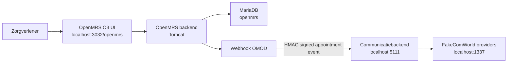

# OpenMRS O3 Distro voor de Communicatiemodule


Deze repository bevat de lokale OpenMRS 3 distributie voor het communicatieplatform. Zorgverleners werken in de standaard OpenMRS O3 interface. De koppeling met de communicatiemodule loopt via een OpenMRS OMOD (`openmrs-webhook-module`) die afspraakgebeurtenissen ondertekend doorstuurt naar de ASP.NET Core backend in `../OpenMRSmoduleBackend`.

> De oude custom Next.js frontend hoort niet meer bij deze architectuur. De gebruikersinterface is OpenMRS O3.

## Inhoud

- [Architectuur](#architectuur)
- [Onderdelen](#onderdelen)
- [Vereisten](#vereisten)
- [Configuratie](#configuratie)
- [Opstarten](#opstarten)
- [Seeding en initialisatie](#seeding-en-initialisatie)
- [Verificatie](#verificatie)
- [Webhook OMOD](#webhook-omod)
- [HTTPS en monitoring](#https-en-monitoring)
- [Beheercommando's](#beheercommandos)
- [Documentatie](#documentatie)
- [Troubleshooting](#troubleshooting)

## Architectuur



## Onderdelen

| Pad | Doel |
| --- | --- |
| `docker-compose.yml` | Start gateway, O3 frontend, OpenMRS backend en MariaDB. |
| `.env.example` | Template voor lokale secrets en webhookconfiguratie. |
| `gateway/` | OpenMRS gateway image/configuratie. |
| `frontend/` | OpenMRS O3 frontend image/configuratie. |
| `distro/` | OpenMRS distributieconfiguratie. |
| `openmrs-webhook-module/` | Java OMOD die OpenMRS events naar de backend pusht. |
| `tests/smoke/` | Smoke-test voor de O3 routes en assets. |
| `tests/ssl/` | Documentatie en scripts voor HTTPS-tests. |

## Vereisten

- Docker Desktop met Docker Compose v2.
- Maven 3.3.9 of hoger als je de OMOD-tests lokaal draait.
- De backend-repository naast deze map: `../OpenMRSmoduleBackend`.
- Een ingevulde `.env` in deze repository.
- Een ingevulde `.env` in `../OpenMRSmoduleBackend`.

Controleer Docker:

```powershell
docker info
docker compose version
```

## Configuratie

1. Maak een lokale `.env`:

   ```powershell
   Copy-Item .env.example .env
   ```

   Linux/macOS:

   ```bash
   cp .env.example .env
   ```

2. Vul minimaal deze waarden in:

   | Variabele | Betekenis |
   | --- | --- |
   | `OMRS_DB_USER` | MariaDB gebruiker voor OpenMRS, bijvoorbeeld `openmrs`. |
   | `OMRS_DB_PASSWORD` | MariaDB wachtwoord voor OpenMRS. |
   | `MYSQL_ROOT_PASSWORD` | Rootwachtwoord voor MariaDB. |
   | `OPENMRS_WEBHOOK_SECRET` | HMAC secret waarmee de OMOD webhooks ondertekent. Moet gelijk zijn aan de backendconfiguratie. |
   | `OPENMRS_WEBHOOK_ORGANIZATION_ID` | Organisatie-id, standaard `hospital-a`. Moet gelijk zijn aan de backendconfiguratie. |

3. Controleer de webhook-URL:

   ```env
   OPENMRS_WEBHOOK_BACKEND_URL=http://host.docker.internal:5111/api/webhooks/openmrs/appointments
   ```

   Deze waarde is correct wanneer de backend via Docker of lokaal op poort `5111` draait.

4. Configureer daarna de backend:

   ```powershell
   Set-Location ..\OpenMRSmoduleBackend
   Copy-Item .env.example .env
   ```

   Belangrijk: `OPENMRS_WEBHOOK_SECRET` en `OPENMRS_ORGANIZATION_ID` in de backend moeten overeenkomen met `OPENMRS_WEBHOOK_SECRET` en `OPENMRS_WEBHOOK_ORGANIZATION_ID` in deze OpenMRS-repository.

## Opstarten

### Volledige stack vanuit de workspace-root

Gebruik dit als je OpenMRS, FakeComWorld en de backend samen wilt starten:

```powershell
cd ..
.\start.ps1
```

Alternatieven:

```cmd
start.bat
```

```bash
./start.sh
```

Het script:

1. controleert of Docker bereikbaar is;
2. start FakeComWorld op `http://localhost:1337`;
3. start deze OpenMRS distro op `http://localhost:3032/openmrs`;
4. start de backend op `http://localhost:5111`;
5. wacht op OpenMRS, backend health en Swagger.

### Alleen OpenMRS starten

Vanuit deze map:

```powershell
docker compose up -d --build
```

OpenMRS heeft bij een lege database enkele minuten nodig om te initialiseren.

### Backend apart starten

```powershell
cd ..\OpenMRSmoduleBackend
docker compose up -d --build
```

## Lokale URL's

| Service | URL |
| --- | --- |
| OpenMRS O3 | http://localhost:3032/openmrs |
| OpenMRS O3 SPA | http://localhost:3032/openmrs/spa/home |
| OpenMRS legacy UI | http://localhost:3032/openmrs/legacy |
| Communicatiebackend | http://localhost:5111 |
| Swagger backend | http://localhost:5111/swagger |
| FakeComWorld | http://localhost:1337 |

## Seeding en initialisatie

Deze repository seedt zelf geen losse demodata via SQL-scripts. De initialisatie gebeurt door OpenMRS en de backend:

| Stap | Waar | Wat gebeurt er |
| --- | --- | --- |
| Database aanmaken | `db` service | MariaDB maakt de database `openmrs` aan op basis van de compose-environment. |
| OpenMRS tabellen | `backend` service | OpenMRS draait database-updates met `OMRS_CONFIG_AUTO_UPDATE_DATABASE=true` en `OMRS_CONFIG_CREATE_TABLES=true`. |
| OpenMRS distributie | OpenMRS Initializer | Modules en globale properties worden vanuit de distro/configuratie geladen. |
| Webhook properties | OMOD via environment | `OPENMRS_WEBHOOK_*` waarden worden beschikbaar als globale properties voor de webhookmodule. |
| Backend seed | `../OpenMRSmoduleBackend` | De backend seedt admin, organisaties, providerconfiguratie en berichttemplates bij startup. |

Voor een volledige werkende koppeling moet de backend eerst of tegelijk draaien, anders schrijft de OMOD mislukte webhookpogingen naar de outbox en probeert later opnieuw.

## Verificatie

Controleer containers:

```powershell
docker compose ps
```

Controleer logs:

```powershell
docker compose logs -f backend
docker compose logs -f gateway
```

Draai de O3 smoke-test:

```powershell
.\tests\smoke\openmrs-spa-smoke.ps1
```

Draai de Java-tests voor de webhookmodule:

```powershell
mvn -pl openmrs-webhook-module test
```

Verifieer daarna in de backend:

```powershell
Invoke-WebRequest http://localhost:5111/health
```

## Webhook OMOD

`openmrs-webhook-module` luistert naar OpenMRS `Encounter` events via de OpenMRS Event Module. Bij een afspraakgebeurtenis maakt de module een JSON payload, ondertekent die met HMAC-SHA256 en post naar:

```text
POST http://host.docker.internal:5111/api/webhooks/openmrs/appointments
```

De backend valideert:

- `X-OpenMRS-Organization-Id`
- timestamp en clock skew
- HMAC signature
- idempotency/event-id

Globale properties voor de OMOD:

| Property | Environment variabele | Beschrijving |
| --- | --- | --- |
| `openmrswebhook.backendUrl` | `OPENMRS_WEBHOOK_BACKEND_URL` | Backend endpoint voor afspraakwebhooks. |
| `openmrswebhook.secret` | `OPENMRS_WEBHOOK_SECRET` | HMAC secret per organisatie. |
| `openmrswebhook.organizationId` | `OPENMRS_WEBHOOK_ORGANIZATION_ID` | Organisatie-id die ook in de backend bestaat. |
| `openmrswebhook.outboxPath` | `OPENMRS_WEBHOOK_OUTBOX_PATH` | Persistent pad voor mislukte webhookpogingen. |
| `openmrswebhook.retryIntervalMillis` | `OPENMRS_WEBHOOK_RETRY_INTERVAL_MS` | Interval voor retries. |

## HTTPS en monitoring

### HTTPS lokaal

Start met de SSL-overlay:

```powershell
$env:COMPOSE_FILE="docker-compose.yml;docker-compose.ssl.yml"
docker compose up -d --build
```

Linux/macOS:

```bash
COMPOSE_FILE=docker-compose.yml:docker-compose.ssl.yml docker compose up -d --build
```

Voor Let's Encrypt:

```env
SSL_MODE=prod
CERT_WEB_DOMAINS=example.com
CERT_CONTACT_EMAIL=admin@example.com
```

Zie ook [`tests/ssl/README.md`](tests/ssl/README.md) en [`tests/ssl/SSL-TESTING.md`](tests/ssl/SSL-TESTING.md).

### Grafana-overlay

```powershell
docker compose -f docker-compose.yml -f docker-compose.grafana.yml up -d
```

Gebruik de monitoring van de backendrepository voor de volledige Prometheus/Grafana pipeline.

## Beheercommando's

| Actie | Commando |
| --- | --- |
| Starten | `docker compose up -d --build` |
| Status bekijken | `docker compose ps` |
| Logs volgen | `docker compose logs -f` |
| Stoppen | `docker compose down` |
| Stoppen en data verwijderen | `docker compose down -v` |
| Images opnieuw bouwen | `docker compose build --no-cache` |

Gebruik `docker compose down -v` alleen als je bewust alle lokale OpenMRS- en MariaDB-data wilt resetten.

## Documentatie

- [Backend README](../OpenMRSmoduleBackend/README.md)
- [Backend webhookcontract](../OpenMRSmoduleBackend/docs/webhook-openmrs-backend.md)
- [Backend teststrategie](../OpenMRSmoduleBackend/docs/testing.md)
- [C4 architectuurdocumentatie](../OpenMRSmoduleBackend/docs/c4/README.md)
- [OpenMRS webhookmodule README](openmrs-webhook-module/README.md)
- [E2E workflowdocumentatie](tests/e2e/README.md)
- [SSL testdocumentatie](tests/ssl/README.md)

## Troubleshooting

| Probleem | Oplossing |
| --- | --- |
| OpenMRS blijft lang laden | Wacht enkele minuten bij een verse database en bekijk `docker compose logs -f backend`. |
| Witte pagina in O3 | Draai `.\tests\smoke\openmrs-spa-smoke.ps1`, wis daarna browsercache en service worker voor `localhost:3032`. |
| Webhooks komen niet binnen | Controleer `OPENMRS_WEBHOOK_BACKEND_URL`, `OPENMRS_WEBHOOK_SECRET` en `OPENMRS_WEBHOOK_ORGANIZATION_ID` in beide projecten. |
| Backend weigert webhook | Controleer of de organisatie-id in de backend is geseed en of de HMAC secret exact gelijk is. |
| Database volledig resetten | `docker compose down -v` en daarna opnieuw `docker compose up -d --build`. |
